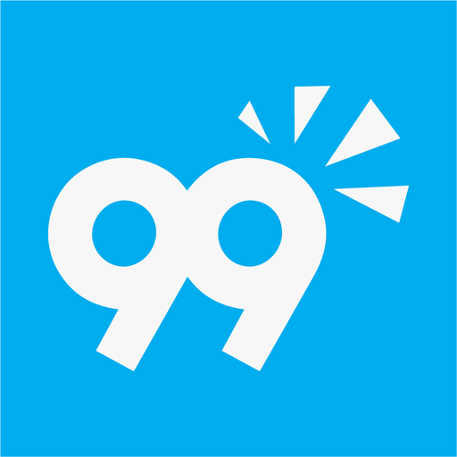
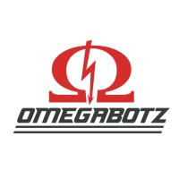

## Mind Group
- *Full Stack Tech Lead* | Dec 21 - Current
- 
- Tags: All Web development Artificial intelligence
- Badges:
  - NodeJS [green]
  - Express [blue]
  - Prisma [red]
  - MySql [yellow]
  - MongoDB [orange]
  - Javascript [gray]
  - TypeScript [cyan]
  - React [purple]
  - React Native [pink]
  - NextJs [black]
  - Git [teal]
  - Redis [red]
  - Python [yellow]
  - Django [cyan]
  - AWS [purple]
  - Linux [teal]
- List Items:
  - Leading the development of different types of applications in teams of 4 to 6 developers.
  - Gathering requirements for projects using the most current technologies on the market.
  - Code review to maintain the quality of code written by developers.
  - Risk management and recovery of projects close to deadline.
  - Maintenance of multiple VPS and instances on AWS to host developed projects.

## 99freelas
- *Python Developer* | Jan 20 - Current
- 
- Tags: All Artificial intelligence Bots / Automation
- Badges:
  - Python [green]
  - Selenium [blue]
  - OpenCV [red]
  - Tensorflow [yellow]
  - Tesseract [orange]
- List Items:
  - Development of bots and automation scripts for different types of clients.

## Who Fixes?
- *Full Stack Developer* | Apr 23 - Sep 23
- 
- Tags: All Web development
- Badges:
  - NodeJS [green]
  - NextJs [black]
  - Django [cyan]
  - Python [yellow]
  - ReactJS [purple]
- List Items:
  - Development of a highly performant, responsive and indexable web system for clients of the Who Fixes? service provision application. Using NextJS on the front end for the best use of SSR and Django performance and security features in the API.

## Omegabotz
- *Python Developer* | Feb 22 - Feb 23
- 
- Tags: All IoT Artificial inteligence
- Badges:
  - Python [yellow]
  - OpenCV [purple]
  - Arduino [cyan]
  - Prototyping [yellow]
- List Items:
  - Development of robots for competitions using intelligence and computer vision with Python.